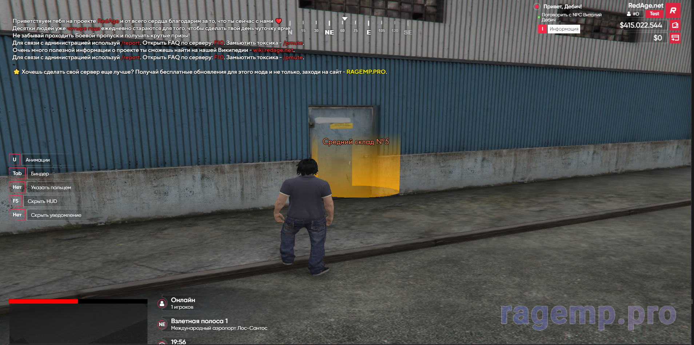
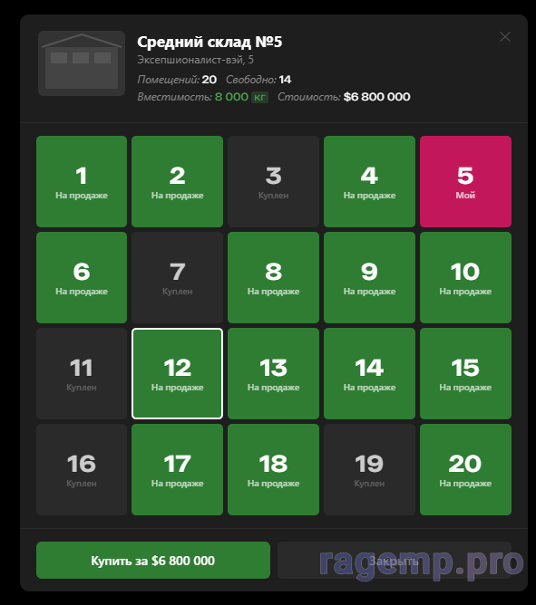
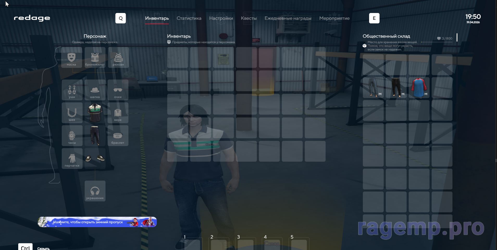

# Public Warehouse system [RedAge v3 / NeptuneEvo]

Система общественных складов для RedAge v3. Суть простая: игроки или семьи могут арендовать ячейки и хранить там свой лут.

## Что внутри:
- 1 Склад - координаты уже в базе.
- Можно юзать как личный склад, так и семейный.
- UI на Svelte (CEF), выглядит опрятно.
- Все данные в MySQL, таблицы приложил.
- Есть команда для админов `/reloadwarehouses` (релоадит конфиги без рестарта).

## Как выглядит:

## Как поставить:
1. Залей `database/setup.sql` в свою базу.
2. Файлы из `dotnet/` раскидай по проекту (там логика на C# под .NET Core 3.1).
3. CEF (интерфейс) лежит в `src_cef/`, клиентская часть в `src_client/`.
4. Не забудь прописать импорты в своем `index.js`. и сделать `npm run build` в папке `src_cef`, и в `src_client` и сделать `dotnet build .\NeptuneEvo.sln` в папке `dotnet`. 

Пользуйтесь, если найдете баги — пишите.
